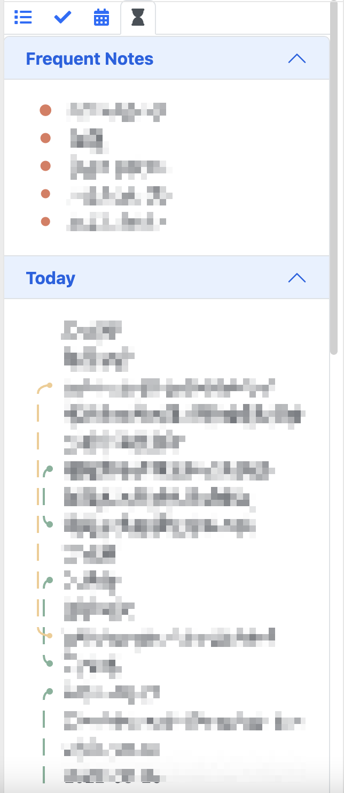

# Joplin Plugin Bundle

Plugins in one panel. Some of the plugins come from other repo, and I modified them to show all the plugin panels in the same panel under different tabs.

> **Why?** : Save my screen space by aggregating those plugins into one panel

> **How?** : Copy & Paste code from existing plugins, and modify them at the code level. I cannot figure out a non-intrusive way to gather them together in one panel.

Current plugins:

* Outline (v1.3.1): https://github.com/cqroot/joplin-outline
* Inline Todo (v1.4.0): https://github.com/CalebJohn/joplin-inline-todo
  * Four different categories: Today, Scheduled, Inbox, and Filter
  * Click the todo items to open corresponding notes
  * Show task priority in different colors
  * Syntax:
    * @Project
    * +tag
    * //date
    * !1 !2 !3 !4: Four level task priority. 1 > 2 > 3 > 4. Default is 4.
* Daily Note: Idea from https://github.com/liamcain/obsidian-calendar-plugin
  * Show whether there is a note for each day in month calendar
  * Click on any day to create a note or open the existing note
* History Panel (v1.0.): https://github.com/alondmnt/joplin-plugin-history-panel

Under development:

* Note Link System (v0.8.0): https://github.com/ylc395/joplin-plugin-note-link-system
* Writing Marker [Planned]: Help to mark text with a label and show them in the sidebar ordered by marker categories:
  * Recheck: text needs to be rechecked
  * Rewrite: text needs to be rewritten
  * ... (It depends on what I need to finish my papers)
* Aggregated Search [Planned]: Allow search multiple resources and present the results in one panel.
  > I treat Joplin as my top-level knowledge base while there exist many other tools behind Joplin. Joplin is not a good choice for document management, so I need to search other tools.
  * Joplin Notes
  * ReadCube Papers: https://www.papersapp.com/
  * ArchiveBox: https://github.com/ArchiveBox/ArchiveBox
  * ... ?

</img>

</img>

## Building the plugin

The plugin is built using Webpack, which creates the compiled code in `/dist`. A JPL archive will also be created at the root, which can use to distribute the plugin.

To build the plugin, simply run `npm run dist`.

The project is setup to use TypeScript, although you can change the configuration to use plain JavaScript.

## Updating the plugin framework

To update the plugin framework, run `npm run update`.

In general this command tries to do the right thing - in particular it's going to merge the changes in package.json and .gitignore instead of overwriting. It will also leave "/src" as well as README.md untouched.

The file that may cause problem is "webpack.config.js" because it's going to be overwritten. For that reason, if you want to change it, consider creating a separate JavaScript file and include it in webpack.config.js. That way, when you update, you only have to restore the line that include your file.
